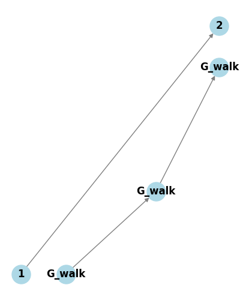

# Optimal-Bus-Route-Finder based on Djikstra`s algorithm
Bus route finder based on a graph constructed from processed GTFS data and using a modified Dijkstra's algorithm.

## Overview
This project aims to create a route-finding system for public transportation in Gdańsk. To build the finder, we use our own ideas, such as a grid onto which we map node positions linearly (significantly speeding up searches), a graph with nodes and edges designed to optimize memory usage, fast node lookup using a k-d tree, and a modified multi-source Dijkstra algorithm to find the shortest possible path in the graph. To create the finder, we need access to GTFS data for the given city.

The Jupyter Notebook guides users through:
1. Generating a geospatial grid overlay on the Gdańsk map.
2. Importing and processing public transportation data, including bus stops and schedules.
3. Creating and visualizing G_transit graph.
4. Implementing a modified multi-source Dijkstra’s algorithm to determine the shortest routes.
5. Testing the finder on your own custom coordinates and timestamps.

Notebook is well-described for better understanding.

## Features
- Generates a grid-based map of Gdańsk.
- Processes public transportation data, including bus stops and arrivals.
- Assigns bus stops to grid cells for efficient route calculation.
- Creating the G_transit graph (where nodes represent bus stops distinguished by their location and the arrival time of different buses) to use Dijkstra's algorithm for finding the shortest path.
- Implements shortest path algorithms for optimized route suggestions.
- Allows data updates when needed to prevent graph overload.
- Generates an interactive HTML map of the shortest path.
- Possibility of extending the concept to any other city where GTFS data is available.

## Usage
- Open the Jupyter Notebook
- Install the required libraries (you will find them in the first cell).
- Execute the cells step by step to process the data.
- Modify the input dataset to analyze different timeframes or locations.
- You can find the results (map visualization at different stages) in the project_results folder.
  
## Dependencies
The project requires the following Python libraries:
- pandas
- geopandas
- numpy
- folium
- matplotlib
- networkx

Ensure that all dependencies are installed before running the notebook.

## Data
The dataset includes:
- Raw GTFS data for Gdańsk from a specific period (.txt format)
- Processed GTFS data (.txt format), optimized for easier use in further applications (more details on data preparation can be found in another project)

## Graph idea
Below are schematic visualizations of the graph we created. We have two different bus routes passing through different stops (see ID numbers).  

    

Here, we have nodes representing the same physical bus stop but at different arrival times of buses. An edge is created only when the user can walk on foot within 10 minutes and catch the bus.

  

Below, we present the method we use to connect different bus stops. For each bus stop, we identify the nearest node in the walking graph (G_walk), calculate the walking time between them, and then assign this value to the edge directly connecting the bus stop nodes. We do not connect G_transit directly with G_walk.

    

## Examples

Below are visualizations of the concepts: a graph overlaid on a grid to accelerate path searching (left) and the fastest bus route from a sample user location to the destination and current time (right):

 

    
    

## Future Improvements
- Practical use of the finder in a mobile application for public transportation.
- Enhancing route optimization algorithms.
- Expanding coverage beyond Gdańsk.

 Share your opinion!

